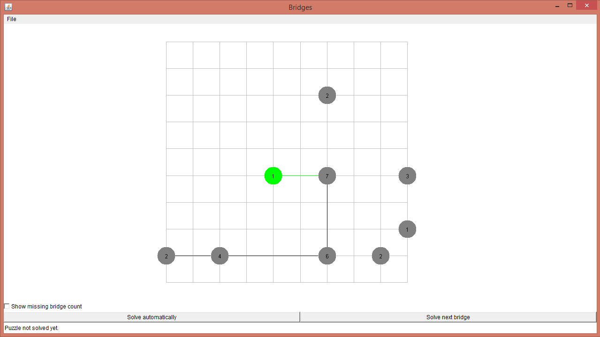

# bridges
> A java implementation of the game *Bridges*.



## About
This is a *Bridges* game application I had to write at uni over the course
of the winter semester 2018/19. It is here mainly to show some code I have written.
For further information on the project see section [Project](#project).

## Getting started
If you simply want to try the game, you can download a Jar-file on the
[releases](https://github.com/messersm/bridges/releases) page. You will
need at least Java version 8 for it.

The **rules** of the game are as follows:
 * Each island can be connected with another neighbouring bridge in
   the four directions north, south, east and west.
 * Two islands can have at most two bridges between them.
 * Each island must be connected to other islands by exactly the same
   number of bridges as their value indicates.
 * All islands must be interconnected.

You can add additional bridges to an island by left-clicking it and
remove a present bridge by right-clicking it. A preview of the bridge
that would be build or removed is shown when hovering over the island.

## Project
The scope of the project was to write a *Bridges* game using Java.
The Application had to be able to read and write a specified puzzle file
format, generate new puzzles and solve puzzles by itself.

There where no grades given on it, but my solution was described as "very good".
(But do keep in mind, that this was a basic course on programming
for a Bachelor's degree.)

In a second stage of the project I had to add the functionality to
merge to puzzles together.

I had experience in Java for only half a year before doing this project, so
there are very likely some issues with it. Right now I have no intention
of developing this code any further, but if I would, here is a list of
things that could be done (and some excuses, why they haven't been done. :-) ):
 * As far as I can judge the used directory structure isn't standard. It should
   be something like ``src/{main,test}/java``. The current structure was specified
   by the project task.
 * The code you see here doesn't have proper test coverage. This is
   partly the case, because it was tested against an external test suite,
   which I do not own and therefore cannot upload here.
 * I used AWT instead of Swing or JavaFX because I wanted to focus on
   the algorithm used and I learned AWT in another course.
   The current GUI can be called functional, but that's about it.
 * There is a layer (implemented by the ``bridges.model.GameModel``
   class) which provides thread-safety when working on the actual bridge puzzle.
   It works really well, but it has a lot of redundancy in it, which
   is caused by the fact, that writing glue code for methods
   with many optional parameters in Java results in the definition
   of many additional methods.
   I think this could be done with less code. (Maybe by letting the
   GUI code handle the thread lock itself...)
 
The only changes I did apply to the code was some cleanup, a bugfix of a
bug which I introduced at the second stage of the project (which didn't allow
you to add two bridges to an island). I also translated the GUI into
English (since it was required to be in German).

## Documentation
You can find the English source code documentation in the [doc](doc/index.html) folder.
There's also a description of the software architecture written in German in the
[documentation](documentation/Architekturbeschreibung.pdf) folder. (The
class ``bridges.util.BoardMerger`` is not mentioned by this document, since it
was added at a later date.)

## How to compile and run
If you want to open the project in an IDE see below. If you simply
want to compile and run the application, this should do:

```
$ git clone https://github.com/messersm/bridges.git
$ cd bridges
$ javac -d bin src/*/*/*.java
$ cd bin
$ java bridges.gui.Main
```

## Using your IDE
If you would like to work on this project, here are some instructions:

If you want to check in the project into IntelliJ IDEA, here's what should work:
Select "File > New > Project from Version Control > Git" and
enter ``https://github.com/messersm/bridges.git`` (or your fork).
Select "yes", when asked, if you want to create an IDEA project,
select "Create project from existing sources" and follow the wizard.
**Important**: When asked, if you want to overwrite ``bridges.iml`` select "Reuse".

As for Eclipse... you're on your own. Basically, you have to add the folders ``src``
and ``test`` as source and add JUnit (4) to your project.
